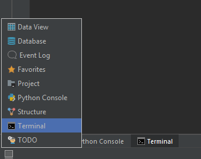

************
Python basis
************

Introduction
============
In dit hoofdstuk lopen we de basis van programmeren met python door. We beginnen met leren hoe we code uitvoeren en hoe we een project opzetten.

Python 2 vs Python 3
--------------------
In de Python community wordt er nog steeds veel gebruikt gemaakt van de oudere versie, Python 2.

Alhoewel Python 3 niet compleet backwards compatible is lijken de 2 versies erg veel op elkaar.
Dus mocht je dingen op het internet vinden met Python 2 zal dit nog steeds bekend overkomen.

Beginnen met Python
===================
Pycharm
---------------
We beginnen met een nieuw ``Pure Python`` project aanmaken in Pycharm. Let goed op dat je de correcte interpreter geselecteerd hebt, en dat je de naam in de url hebt aangepast!

Voor gemak heeft Pycharm een paar handige tools ingebouwd al. Waaronder een ``Terminal`` zodat je geen commandline apart open hoeft te houden.
En een ``Python Console``, dit is de Python interpreter waar in het volgende stuk iets wordt uitgelegd.

Mocht je ze niet zien onderin, klik dan op het grijze vierkantje links onderin. Dit toggled de zichtbaarheid van de zijbalken, en bevat ook een menu met alle opties.

Pythons interactieve interpreter
--------------------------------
Door simpelweg het ``python`` command in te voeren op een commandline zonder enige parameters open je de interactieve interpreter. (Dit kan dus ook via de ``Python Console`` onderin Pycharm)
Dit is een text console waar je python code regel voor regel kan invoeren - deze wordt dan direct uitgevoerd.

Hier is een voorbeeld wat je krijgt te zien als je het ``python`` commando gebruikt::

    Python 3.6.1 (v3.6.1:69c0db5, Mar 21 2017, 17:54:52) [MSC v.1900 32 bit (Intel)] on win32
    Type "help", "copyright", "credits" or "license" for more information.
    >>>

.. Note:: Hier gaan we ervan uit dat het ``python`` command Python 3 opstart, maar als je meerdere versies van Python hebt moet je misschien specifiek zeggen welke versie je wilt. Dus bijvoorbeeld ``python3`` of zelfs ``python3.6``. Als je de interpreter opstart zie je gelijk in het begin de versie, zo weet je dus of je de correcte versie hebt of niet.

Als je in de interpreter een string, nummer of andere variabele typt, echoot het de waarde in de console::

    >>> "hello world"
    'hello world'
    >>> 5
    5

Dit houd dus in dat je niet expliciet een print command hoeft te gebruiken om de waarde van een variabele uit te printen.
Je kan gewoon direct de variabele invoeren::

    >>> x = 4
    >>> x
    4

Dit werkt niet als je werkt met bestanden, als je dan de eerste 2 lijnen in zou voeren en het zou uitvoeren zou je niks zien.
Dan moet je de print functie gebruiken om de waarde van ``x`` te printen::

    x = 4
    print(x)

In de meeste code voorbeelden in deze opdrachten wordt er gebruik gemaakt van expliciet printen. Op deze manier kan de code uitgevoerd worden via een bestand of via de interpreter.

De interpreter is vooral handig als je kleine stukjes code wilt testen. Het is een simpele en snelle manier om te kijken of code werkt en of de syntax correct is.

Python bestanden
----------------
De interpreter is handig om code te testen en kijken hoe alles werkt, maar voor grotere programma's gebruiken we bestanden om alles op te slaan.

Grotendeels hebben Python bestanden de ``.py`` extensie. Zodra je een bestand hebt aangemaakt en de gewenste code erin hebt staan kan je het uitvoeren via het eerder gebruikte ``python`` command.
Bijvoorbeeld, als je bestand ``main.py`` heet::

    python main.py

Dit zorgt ervoor dat Python het programma uitvoert.

Zoals ieder source code bestand is een Python bestand gewoon een text bestand. Dit betekent dus dat je het kan aanpassen met welke text editor dan ook.
Maar het is aangeraden om een IDE zoals Pycharm te gebruiken. Of de IDE van Python zelf, genaamd IDLE.

Packages
--------
Python maakt het heel makkelijk om libraries/packages te downloaden. Dit zorgt ervoor dat mensen niet continue opnieuw het wiel hoeven uit te vinden.

Packages zijn, het zit hem in de naam, pakketten met code erin. Dus als iemand bijvoorbeeld een heel systeem heeft gemaakt om foto's aan te passen kunnen zij dit online zetten zodat iedereen er gebruik van kan maken.
Hoe makkelijk het downloaden ook is, je wilt niet je hele project een en al packages en libraries maken. Hoe meer packages je gebruikt, hoe afhankelijker je wordt. Dus als er iets aan hun kant kapot gaat, gaat jouw code ook kapot en kun je er niks aan doen..

De `Python Package Index <http://pypi.python.org/pypi>`_ (PyPI) is een enorme collectie van al bestaande Python packages.
Je kan hier packages van installeren door middel van de ``pip`` tool. Deze tool komt standaar met Python en is cross-platform.

Hier is een voorbeeld van hoe je bijvoorbeeld een package genaamd ``django`` download met pip::

    pip install django

.. Note:: Net zoals met het ``python`` command kan de precieze naam liggen aan je installatie. Er is een grote kans dat als je ``python3.6`` gebruikt je ook ``pip3.6`` moet gebruiken. Hetzelfde dus voor ``python3`` en ``pip3`` etc, etc.

Extra informatie
----------------
In deze opdrachten zal er veel gebruikt worden gemaakt van ingebouwde functies en types/modules uit de standaard libraries.
Alhoewel er wel wat informatie staat in de hoofdstukken, is het bij verre na niet alles en stellen wij voor om de `official Python documentation <http://docs.python.org/3/>`_ ernaast te houden als referentie en mocht je extra info nodig hebben.

Essentiele onderdelen in Python
===============================
In veel van de moderne talen betekenen woorden niks behalve als ze op een bepaalde manier staan met correcte leestekens.
Dit is ook het geval met de Python programmeer taal. De Python interpreter kan correct gestructurueerde code lezen en uitvoeren.
Bijvoorbeeld, de volgende Python code is correct gestructurueerd en zal worden uitgevoerd::

    print("Hello, world!")

Vele andere talen vereisen veel meer structuur in hun meest simpele programma's. Maar in Python is deze enkele lijn aan code, wat een simpel bericht uitprint, meer dan genoeg om te werken.
Alleen is het niet een erg informatief voorbeeld van Pythons syntax -- dus zie hieronder een iets gecompliceerder stuk code wat eigenlijk zo goed als hetzelfde doet als de enkele lijn::

    #Dit is de main functie
    def my_function():
        print("Hello, world!")

    my_function()

.. Note:: De eerste regel van dit programma is een comment. Een hash (``#``) duid het begin van een comment aan. De interpreter zal alles wat de hash volgt, op dezelfde lijn, negeren. Er zal later in dit hoofdstuk verdiept worden in comments.

Keywords
--------
In de bovenstaande code maken we gebruik van bijvoorbeeld het woord ``def``. Dit is een zogeheten keyword. Dit zijn woorden die gereserveerd zijn door Python.
Ze mogen alleen gebruikt worden voor waar ze bedoeld voor zijn, en niet meer.
Dit zijn keywords in Python::

  False      class      finally    is         return
  None       continue   for        lambda     try
  True       def        from       nonlocal   while
  and        del        global     not        with
  as         elif       if         or         yield
  assert     else       import     pass
  break      except     in         raise

